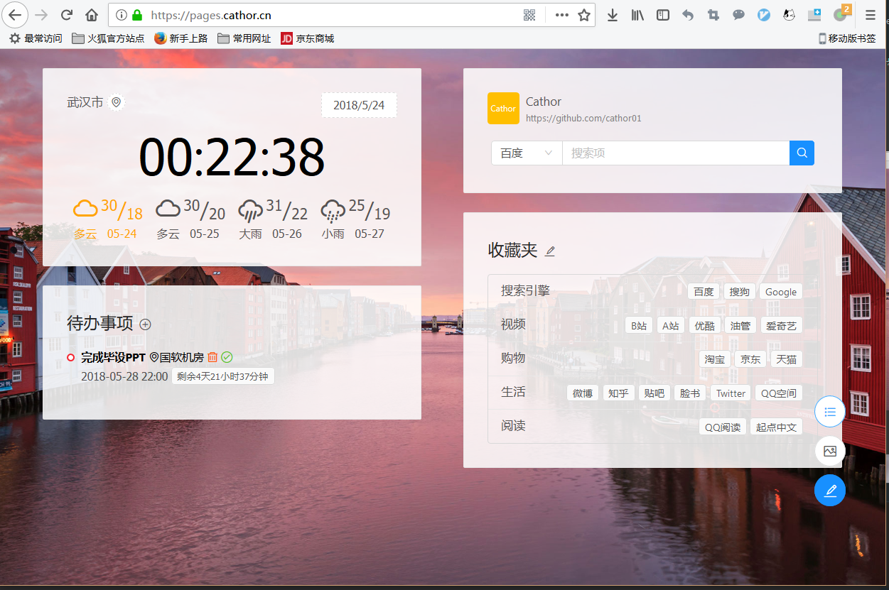
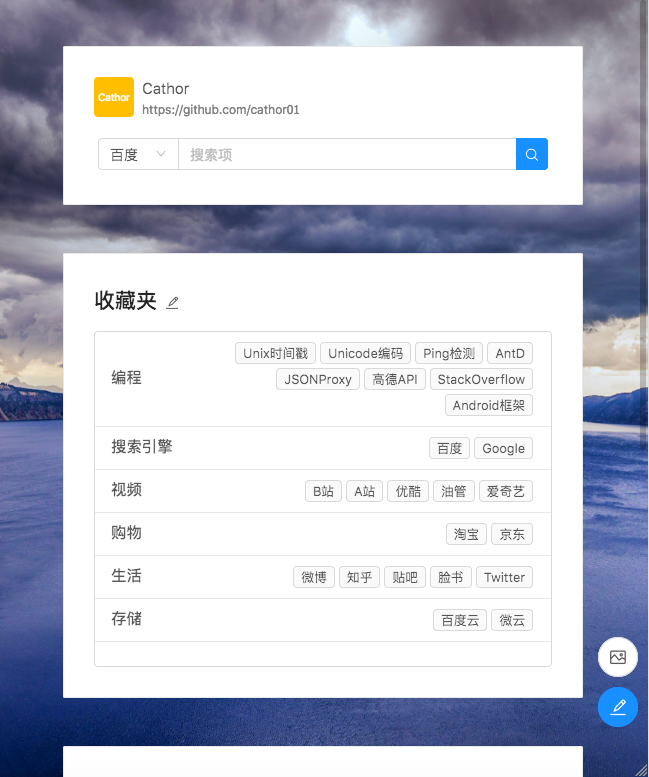

## 现代浏览器主页、新标签页替换页
> 说的就是现代标签页，这辈子都不会支持IE 9以下的


#### 部署地址：

​	https://pages.cathor.cn (Powered by Github Pages)

#### 当前版本： 

​	v0.3

#### 推荐使用场景：

1. 屏幕尺寸大于等于1366 * 768的电脑的现代浏览器（宽度小于1000会进入竖屏显示模式）
2. iPad
3. 手机竖屏使用（横屏也是竖向模式）
4. 说不定可以在Wallpaper Engine等桌面显示工具中使用？（未测试）

#### 预览效果：
* 横屏显示：

  
* 竖屏显示：

  

#### 使用需求：

1. 对于浏览器主页和标签页太丑无法接受的
2. 对于[知乎](https://zhihu.com)上推荐的各类主页功能和界面都不满意的
3. 对于Firefox的默认新标签页和其他扩展标签页控件无法使用Vimium-FF而苦恼的（It's me!）
4. 。。。。。。（都看到这里了还在乎什么？😂）


#### 功能介绍：

1. 搜索功能，默认配置了四个搜索选项（百度、Bing、Google、搜狗）供选择，并采用搜狗的搜索建议，选择后会保存在localStorage中，可以通过修改配置文件进行额外配置（还有一个User的功能，暂时没做界面，想改去配置文件进行修改）

2. 收藏夹，需要点击旁边的配置图标进行定制，如下图所示：

   

   * 添加新分组可以增加一行
   * 标题左侧❌会删掉本行所有数据，请慎重
   * 点击新标签会在该行配置一个收藏页面
   * 标签右侧的❌会删掉该标签
   * 可以通过配置文件中tags对应值进行修改

3. 天气、时间，会自动根据IP地址去获取所在城市，并查询当前城市最近4天的天气，可以点击城市名旁的定位图标刷新城市与天气，每天默认只会获取一次数据，由于接口有每日访问数量限制，请勿无聊点击刷新；右上角有个日期插件，展示还没找好节日信息的接口，所以没做额外功能，该功能暂时没有可配置项。

4. 待办事项配置：，可以通过标题旁➕添加新的待办事项：

   
   
   * 优先级会显示于任务列表左侧圆圈，红色表示高优先级，橙色表示普通优先级，绿色表示低优先级。
   * 随着任务时间的逼近，待办任务的颜色会由黑色变成黄色，然后逐渐变成红色，用以提醒用户。
   * 任务描述右侧两个图标分别为删除任务和完成任务图标。
   * 任务列表按照任务时间由近至远排序。

5. 右下角仨图标：

   

   * 上部按钮用来控制卡片顺序，以及是否显示，如下图所示
    
   * 中间的可以选择背景图片（换后不能换回来，暂时需手动删除localStorage的相关字段）
   * 下面的用来修改配置文件，推荐对现有配置进行备份，同时可以在其他浏览器进行恢复操作。

#### 附件

1. 配置文件示例:

   ```json
   {
       "todo": [
           {
               "id": 1527003650060,
               "time": "2018-06-15 14:30",
               "level": "high",
               "desc": "项目系统分析会议",
               "location": "15楼西会议室",
               "status": "undo"
           },
           {
               "id": 1527003726505,
               "time": "2018-06-20 11:00",
               "level": "low",
               "desc": "新人培训计划",
               "location": "5楼东侧工位",
               "status": "undo"
           },
           {
               "id": 1527003613708,
               "time": "2018-06-30 14:30",
               "level": "normal",
               "desc": "XX产品需求分析",
               "location": "12楼东会议室",
               "status": "undo"
           }
       ],
       "search": {
           "searchEngine": {
               "items": [
                   [
                       "百度",
                       "https://www.baidu.com/baidu?wd="
                   ],
                   [
                       "搜狗",
                       "https://www.sogou.com/web?query="
                   ],
                   [
                       "Bing",
                       "https://cn.bing.com/search?q="
                   ],
                   [
                       "Google",
                       "https://www.google.com/search?q="
                   ]
               ],
               "option": "https://www.sogou.com/web?query="
           },
           "user": {
               "name": "Cathor",
               "homePage": "https://github.com/cathor01"
           }
       },
       "tags": [
           {
               "name": "搜索引擎",
               "value": [
                   [
                       "百度",
                       "http://www.baidu.com"
                   ],
                   [
                       "搜狗",
                       "https://www.sogou.com/web?query="
                   ],
                   [
                       "Google",
                       "https://www.google.com"
                   ]
               ]
           },
           {
               "name": "视频",
               "value": [
                   [
                       "B站",
                       "https://bilibili.com"
                   ],
                   [
                       "A站",
                       "http://www.acfun.cn/"
                   ],
                   [
                       "优酷",
                       "http://youku.com/"
                   ],
                   [
                       "油管",
                       "https://www.youtube.com/"
                   ],
                   [
                       "爱奇艺",
                       "http://www.iqiyi.com/"
                   ]
               ]
           },
           {
               "name": "购物",
               "value": [
                   [
                       "淘宝",
                       "https://www.taobao.com/"
                   ],
                   [
                       "京东",
                       "https://www.jd.com/"
                   ],
                   [
                       "天猫",
                       "https://www.tmall.com/"
                   ]
               ]
           },
           {
               "name": "生活",
               "value": [
                   [
                       "微博",
                       "https://weibo.com"
                   ],
                   [
                       "知乎",
                       "https://www.zhihu.com/"
                   ],
                   [
                       "贴吧",
                       "https://tieba.baidu.com"
                   ],
                   [
                       "脸书",
                       "https://www.facebook.com/"
                   ],
                   [
                       "Twitter",
                       "https://twitter.com/home"
                   ],
                   [
                       "QQ空间",
                       "https://qzone.qq.com/"
                   ]
               ]
           },
           {
               "name": "阅读",
               "value": [
                   [
                       "QQ阅读",
                       "http://book.qq.com/"
                   ],
                   [
                       "起点中文",
                       "https://www.qidian.com/"
                   ]
               ]
           }
       ],
       "cardList": [
           "time", "todo", "search", "tag"
       ]
   }
   ```
   

   raw文件见：<a href="./docs/home_config.json">home_config</a>